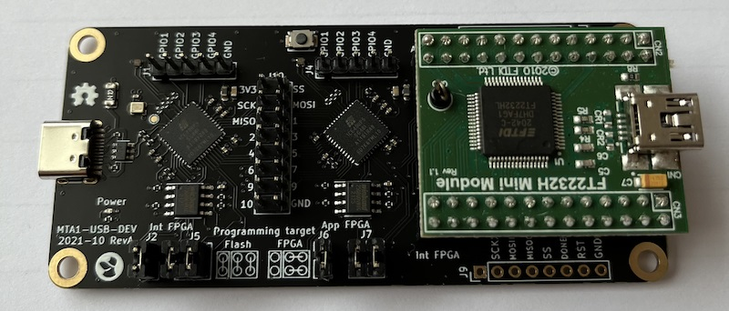

# mta1-usb-dev

This is the original TKey design, intended as a development platform.
It is a larger PCB, that connects to a PC via a USB C cable.

Main features:
- 2 ICE40 FPGAs.

- The first ICE40 (Interface FPGA) is connected to a USB C plug, and
is loaded with a gateware that contains a soft USB device. This
gateware acts as an USB-to-GPIO interface to the second ICE40.

- The second ICE40 (application FPGA) is loaded with a RISC-V soft
core containing the security firmware. User applications are run on
this gateware.

- The second ICE40 also has an input button for user presenence
detection.

- An FTDI module is included for programming both the Application and
Interface FPGAs.

- Both ICE40s can be configured to boot from included SPI flash
memories, NVCM, or be live programmed from the FTDI module.

- All GPIO lines between the two FPGAs, as well as all programming
signals, are exposed on 0.1" headers for probing.
